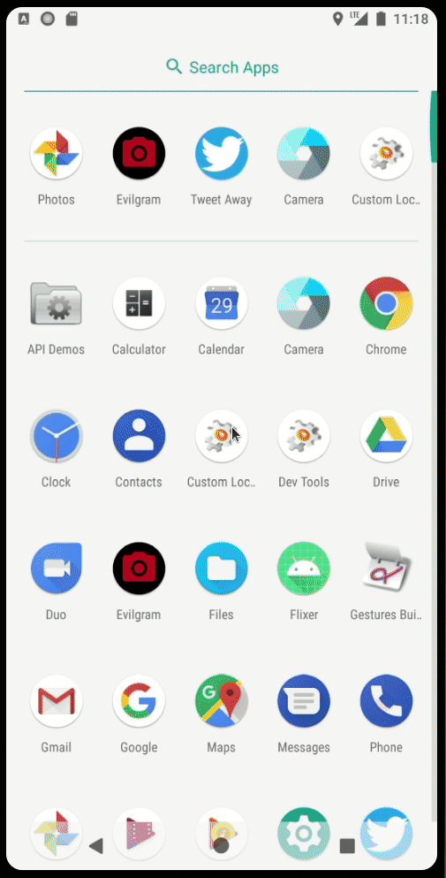
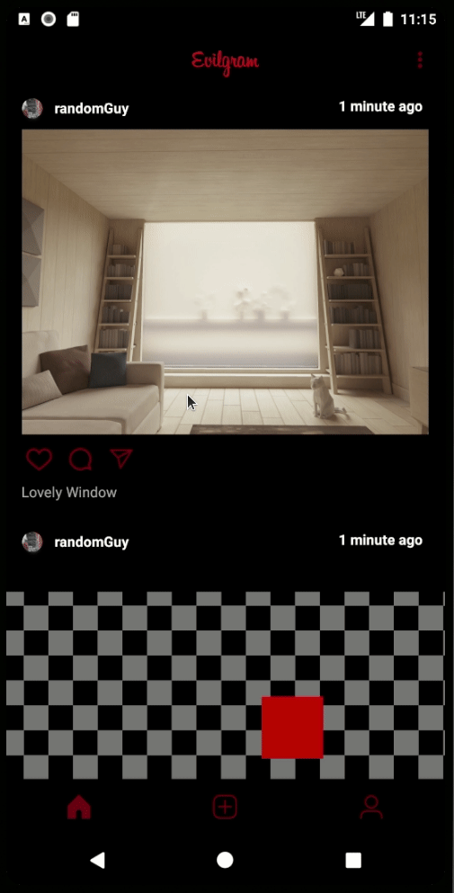
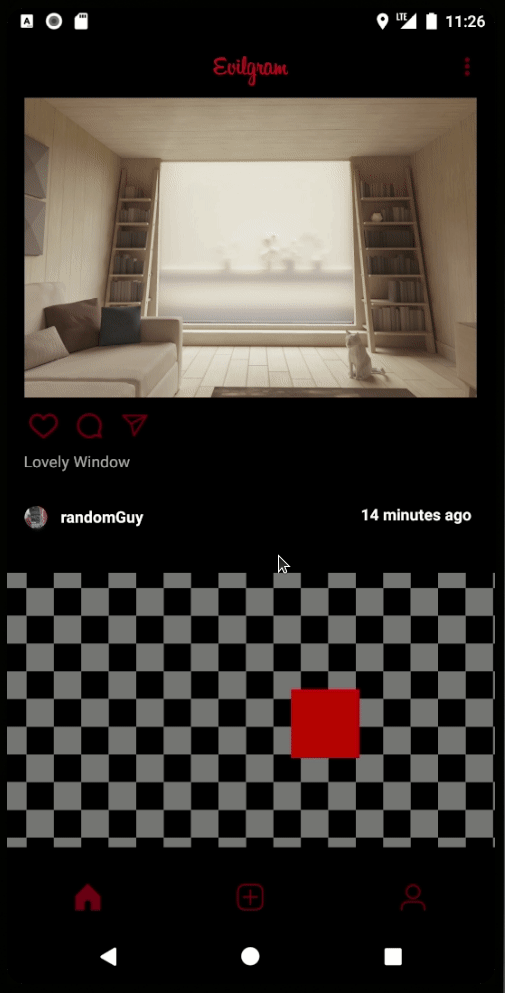

# Project 3 - *Evilgram*

**Evilgram** is a photo sharing app similar to Instagram but using Parse as its backend.  The only thing evil about it is its color theme.

## User Stories / Functional Requirements
- User can view the last 20 posts submitted to "Instagram".
- The user should switch between different tabs - viewing all posts (feed view), compose (capture photos form camera) and profile tabs (posts made) using fragments and a Bottom Navigation View. (2 points)
- User can pull to refresh the last 20 posts submitted to "Instagram".
- User sees app icon in home screen and styled bottom navigation view
- User can load more posts once he or she reaches the bottom of the feed using infinite scrolling.
- Show the username and creation time for each post.
- User can tap a post to view post details, including timestamp and caption.
- Allow the logged in user to add a profile photo
- Display the profile photo with each post
- Style the feed to look like the real Instagram feed. (Except for color theme!  This is intentional)
- Instagram theme changed to something decidely more evil :)

TODO:
- Tapping on a post's username or profile photo goes to that user's profile page and shows a grid view of the user's posts 
- User can comment on a post and see all comments for each post in the post details screen.
- User can like a post and see number of likes for each post in the post details screen.

## Video Walkthrough

Here's a walkthrough of implemented user stories:

### Feed, Fragments, Bottom Navigation
 

### Infinite Scroll
 

### Uploading/Displaying Profile Photo
 

### Pull to Refresh
 

### Detail View
 

## Notes

Right now, only photos taken in landscape mode are supported.  
Will need to build a custom camera activity to get functionality I want.

## Open-source libraries used

- [Android Async HTTP](https://github.com/codepath/CPAsyncHttpClient) - Simple asynchronous HTTP requests with JSON parsing
- [Glide](https://github.com/bumptech/glide) - Image loading and caching library for Android
